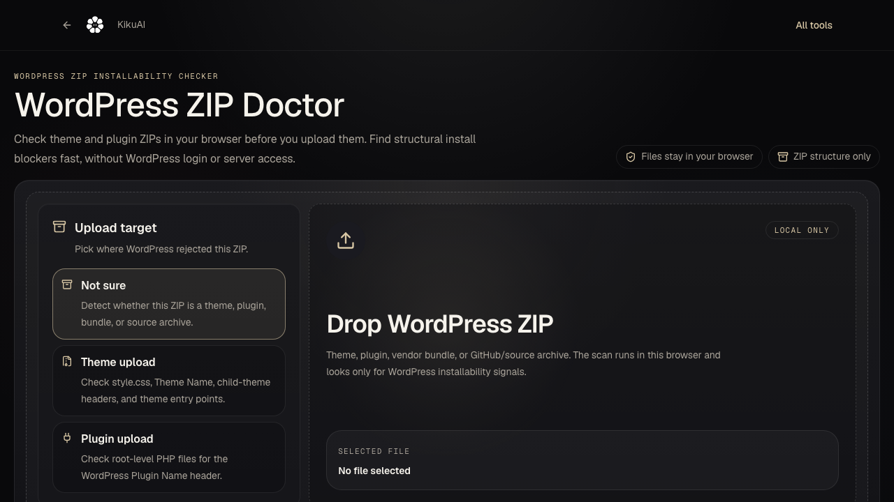

# WordPress ZIP Doctor

WordPress ZIP Doctor is a browser-local inspector for WordPress theme and plugin ZIPs before upload.

**[Open the hosted checker](https://kikuai.dev/tools/wordpress-zip-doctor/)**

[Docs](#what-it-checks) · [Examples](#quickstart) · [Limitations](#what-it-does-not-do)



Sample output:

```text
Verdict: Repackage before upload
Next action: upload the generated installable ZIP or review the Markdown report
```

## Quickstart

Serve the static files over HTTP. The entry point uses JavaScript modules, so
opening `index.html` through `file://` is not supported.

```bash
python3 -m http.server 4174
```

Then open:

```text
http://localhost:4174/
```

Expected result: the app loads a ZIP dropzone plus built-in pain-path demos for missing `style.css`, missing plugin headers, nested vendor bundles, source archives, and wrong upload targets.

## What it checks

- Theme ZIPs: `style.css`, `Theme Name`, and the required parent-theme entry point (`index.php`, `templates/index.html`, or `block-templates/index.html`). Child themes may pass with a `Template` header.
- Plugin ZIPs: a root-level PHP file with a valid `Plugin Name` header.
- Vendor bundles: one nested installable ZIP or one repackable package folder.
- Source archives: common GitHub/source-package shapes that are not ready for WordPress upload.
- Safety: browser-local caps for entry count, declared extracted size, nested ZIP depth, unsafe paths, encryption, and compression ratio.

## What it can export

- The exact ZIP to upload when the package is already installable.
- A repackaged ZIP when there is one clear installable folder inside the archive.
- A privacy-safe Markdown report with the verdict, expected WordPress structure, found package shape, next action, artifact availability, and sanitized metric outcome.

## What it does not do

- It does not ask for WordPress credentials.
- It does not upload your ZIP to a server.
- It does not execute PHP.
- It does not validate licenses.
- It does not scan for malware.
- It does not fix hosting, permissions, upload limits, demos, or database errors.

## Development

```bash
npm test
npm run smoke
```

Expected test result: 17 Node test cases pass and the static smoke check finds the browser app entry points.

## License

MIT. See [LICENSE](LICENSE).
